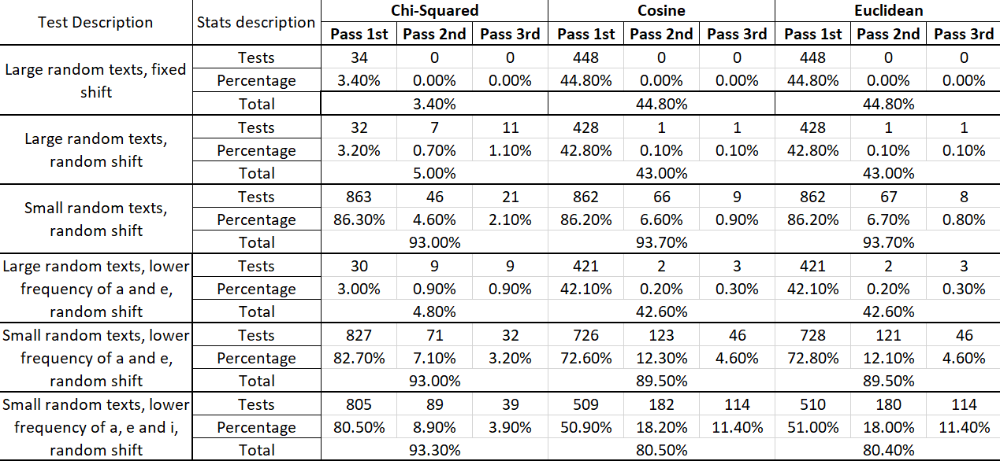

# Report: Distance calculation methods for decrypting Caesar's cipher

For this analysis, 3 different metrics for distance calculations have been used, namely:
- Chi-Squared distance
- Cosine distance
- Euclidean distance

The purpose of this report is to highlight the advantages and short-comings of the methods listed above.

## Conducting the tests

### Programs used

The folder [python_scripts](python_scripts) contains the script files used to facilitate testing.
Both `generate_texts_lower_frequencies.py` and `generate_texts_randomly.py` generate a large text file with 1000
lines, each line containing a sequence for testing. Each script may receive a parameter to control the total length
of the sequence and the first script may skew the words used by reducing the frequencies of provided letters.
Both programs use the words from a supplied dictionary file. For the purposes of this analysis, the file `dictionary.txt`
contains a little bit over 300 000 words.

The script `apply_caesar_cipher.py` transforms the outputs of the above programs by applying a random or fixed shift
and outputs the new text together with the shift used.

The final output is then run through `run_tests.c`, which reads a sample distribution of letters and outputs the necessary data to conduct
this analysis: the total test count, and the passed tests for each distance metric, taking into account 2nd and 3rd
guesses.

### Analysis

The below table illustrates the data that was gathered.

Looking at the first 2 tests, one may notice that shifts do not have a noticeable impact on the results of the attack.
Whilst the percentages differ a little, and random shifts produce some 2nd and 3rd guesses, these fluctuations
are attributed to edge cases where the incorrect histogram is "closer" to the reference distribution of letters. This
happens largely when enough uncommon letters appear in a sequence that some shift may now count these towards a more common
letter in the English language, namely `a` or `e`. This may result in an overall smaller distance, outranking the actual
answer.

Another noticeable fact is that Chi-Squared performs a lot worse on very large texts, whereas Euclidean and Cosine are
extremely similar. The similarity of Euclidean and Cosine is seen across all tests, with very little differences, of which
all of them may be attributed to rounding errors. These metrics are nearly identical because the frequency always
sums up to the number of letters in the text (or alphabet in case of the reference distribution), giving the vectors
of these points a similar magnitude. The Cosine distance is dependent on the angle between vectors, which in this
case, with similar magnitudes, results in similar distances.

It was somewhat expected that Chi-Squared would perform worse on larger bodies of text as small deviations from the reference
distribution are penalized and this results in very noisy results. It is does noticeably better on smaller bodies of text.

Another area where Chi-Squared shines is when dealing with unusual distributions. The last 2 tests show a significant difference
if we look at the 1st guess percentage, especially when less of the common letters appear in the texts. Whilst overall
guess percentages are somewhat close, we see that Euclidean and Cosine metrics have a significant rise in 2nd and 3rd guesses.
This is due to what was mentioned in the 1st paragraph: some shifts put rare letters on the place of more common ones,
outranking the actual answer. Chi-Squared is not largely affected by this as it does not calculate a distance per se,
but rather a weight for each of the letters.

## Conclusions

Through this analysis, we have observed distinct behaviors in the three distance 
metrics used for decrypting Caesar-ciphered text. While Euclidean and 
Cosine distances performed almost identically across all tests, 
Chi-Squared showed noticeable differences, excelling in some cases while struggling in others.

The primary takeaway is that Chi-Squared distance is highly sensitive to small variations in letter 
frequency, making it unreliable for larger texts but potentially more effective for shorter sequences 
or unusual letter distributions. On the other hand, Euclidean and Cosine distances provide stable 
and consistent results, making them more suitable for general-purpose decryption, particularly for 
longer texts where frequency distributions are more balanced.

Ultimately, the choice of distance metric depends on the characteristics of the text being analyzed. 
If the text is short or contains skewed letter distributions, Chi-Squared may offer advantages. 
However, for larger, more typical English text samples, Euclidean and Cosine distances are the more 
robust and reliable choices.